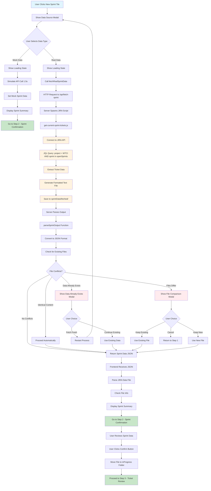

# Fetch Current Sprint Flow Diagram

This diagram shows the complete flow from when a user clicks the "New Sprint" tile to when they see real data in the sprint confirmation step.

## Key Components Breakdown

### Frontend Components
- **UI Layer**: `ui/index.html` - New Sprint tile and modals
- **JavaScript**: `ui/app.js` - Event handlers and data processing
- **Server**: `ui/server.js` - API endpoints for UI server

### Backend Components  
- **Main Server**: `server.js` - Primary API server
- **JIRA Script**: `get-current-sprint-tickets.js` - JIRA data fetching
- **Environment**: `env.tin` - JIRA credentials and configuration

### Data Flow Points
1. **User Interaction**: Click → Modal → Data Type Selection
2. **Mock Path**: Simulated data for testing/development
3. **Real Path**: JIRA API → File Generation → Server Processing
4. **Conflict Resolution**: File comparison and user decision handling
5. **Data Display**: Sprint summary with ticket preview
6. **File Management**: Organized folder structure (fetched/inProgress/completed)

### Error Handling
- **Network Failures**: Fallback to mock data
- **File Conflicts**: User decision modals
- **Data Validation**: Content comparison and duplicate detection
- **Server Issues**: Graceful degradation and error messages
